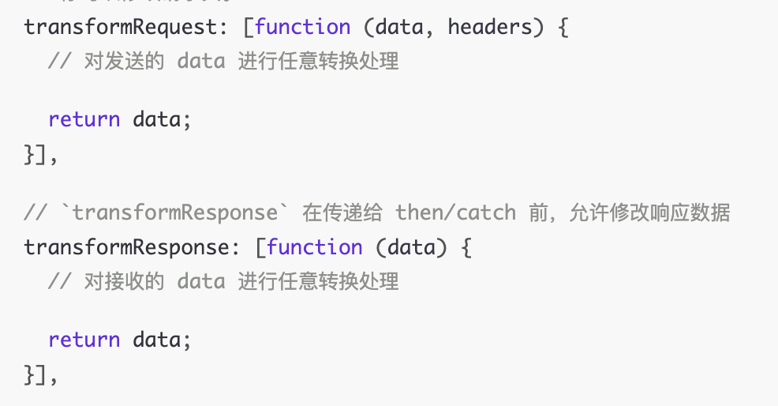

## dispatchRequest
源码在`core/dispatchRequest.js`文件中，实现代码如下
```js
export default function dispatchRequest(config) {
  // 1. 用来抛出错误，终止请求
  throwIfCancellationRequested(config);
  // 2. 格式化config.headers
  config.headers = AxiosHeaders.from(config.headers);
  // 3. 转换请求数据
  config.data = transformData.call(
    config,
    config.transformRequest
  );
  // 4. 设置请求头Content-Type
  if (['post', 'put', 'patch'].indexOf(config.method) !== -1) {
    config.headers.setContentType('application/x-www-form-urlencoded', false);
  }
  // 5. 拿到对应环境的请求实体
  const adapter = adapters.getAdapter(config.adapter || defaults.adapter);
  // 6. 发送请求
  return adapter(config).then(function onAdapterResolution(response) { // 成功回调
    throwIfCancellationRequested(config);
    // 7. 转换响应数据
    response.data = transformData.call(
      config,
      config.transformResponse,
      response
    );
    response.headers = AxiosHeaders.from(response.headers);
    return response;
  }, function onAdapterRejection(reason) { // 失败回调
    // 不是通过cancelToken取消请求所造成的错误 ，正常的请求的错误处理
    if (!isCancel(reason)) {
      throwIfCancellationRequested(config);
      // 7. 转换响应数据
      if (reason && reason.response) {
        reason.response.data = transformData.call(
          config,
          config.transformResponse,
          reason.response
        );
        reason.response.headers = AxiosHeaders.from(reason.response.headers);
      }
    }

    return Promise.reject(reason);
  });
}
```
实现流程如下:
- 传入请求配置`config`，然后调用`throwIfCancellationRequested`检测抛错，终止请求发出
- 通过`AxiosHeaders.from`方法获取到`config.headers`
- 对传入的请求配置，进行`transformData`的处理，获取到处理后的请求数据`config.data`
- 对`put`、`post`、`patch`等方法，设置请求头`Content-Type`值为`application/x-www-form-urlencoded`
- 通过适配器`adapter`方法，判断当前客户端所处的环境分别调用`xhr`(浏览器环境)，`http`模块node环境来发送请求
- 最后通过`transformData`处理，获取处理后的响应数据，最终返回出去，如果当前请求设置了`响应拦截器`那么这个响应数据会被当做拦截器的入参传入，并通过链式调用进行处理，最终返回

### throwIfCancellationRequested
这个函数的作用比较简单，就是判断当前请求有没有被终止，有的话就抛出一个`CanceledError`错误，中断请求发出
```js
function throwIfCancellationRequested(config) {
  if (config.cancelToken) {
    // 这个是需要发送第一次请求之后，再发送第二次请求时
    // 如果第一次请求服务端还没有响应, 这个时候第一个请求就会被取消
    // 可用于取消重复点击，造成的数据紊乱问题
    config.cancelToken.throwIfRequested();
  }
  // 如果有相关的业务，需要判断请求在某些特定条件下不发请求，可以用到这个字段
  // 可以在请求拦截器里处理config，直接设置config.signal.aborted就可以不发送请求(有需要的话可以直接设置， 不与AbortController结合使用)
  // 通常与 AbortController() 配合使用，来中断请求(与cancelToken作用相同)
  if (config.signal && config.signal.aborted) { // 直接中断程序，后面的程序不运行了
    throw new CanceledError(null, config);
  }
}
```
### AxiosHeaders
::: tip
用于配置的请求头(headers)的包装，单独放在后面一个章节，[点击查看](./AxiosHeaders.md)
:::

### transformData
*在dispatchRequest.js中是这么调用的*，主要是对请求数据和响应数据进行业务处理，得到想要的数据
```js
transformData.call(
  config,
  config.transformResponse,
  response
)
```
代码在`core/transformData.js`文件中:
```js
export default function transformData(fns, response) {
  // fns 处理函数的数组
  // response 相应数据(只有响应的时候会传，请求就是undefined)
  // this transformData.call方法执行时，绑定的config对象
  const config = this || defaults;
  const context = response || config;
  const headers = AxiosHeaders.from(context.headers);
  let data = context.data;
  utils.forEach(fns, function transform(fn) {
    // 循环遍历fns，然后把每次处理完的data，当做下一个fn处理函数的参数传入
    // fn的入参: data, headers, response.status 三个入参
    data = fn.call(config, data, headers.normalize(), response ? response.status : undefined);
  });
  headers.normalize();
  return data;
}
```
官网下的截图如下，官网只列出了前两个参数，其实还有第三个参数，就是相应数据的status，如果有相关业务需要根据响应的`状态`来做处理的话，这个参数就排上用场了


### adapters(适配器)
`adapters`的作用就是通过环境的判断，从而调用对应的http请求
::: code-group
```js [dispatchRequest.js]
// dispatchRequest 获取适配器的调用方法
const adapter = adapters.getAdapter(config.adapter || defaults.adapter);
```
```js [defaults.js]
const defaults = {
  adapter: ['xhr', 'http'],
  ....
}
```
:::
可以看到适配器是可以自定义的，如果没设置就使用默认的`['xhr', 'http']`

适配器的源码在`core/adapter.js`文件中，如下：
```js
const knownAdapters = {
  http: httpAdapter, // node环境下的请求方式
  xhr: xhrAdapter // 浏览器环境下的请求方式
}

utils.forEach(knownAdapters, (fn, value) => {
  if(fn) {
    try {
      Object.defineProperty(fn, 'name', { value })
    } catch (e) {
    }
    Object.defineProperty(fn, 'adapterName', { value })
  }
})

export default {
  getAdapter: (adapters) => {
    // 默认adapters就是['xhr', 'http']
    adapters = utils.isArray(adapters) ? adapters : [adapters];
    const {length} = adapters;
    let nameOrAdapter;
    let adapter;
    for (let i = 0; i < length; i++) {
      // 循环遍历adapters数组
      nameOrAdapter = adapters[i];
      // 判断nameOrAdapter 是否为字符串
      // 如果是字符串则在knownAdapters对象里匹配对应的值
      // 浏览器环境下会匹配到 xhrAdapter 方法
      adapter = utils.isString(nameOrAdapter) ? knownAdapters[nameOrAdapter.toLowerCase()] : nameOrAdapter
      if(adapter) {
        break;
      }
    }
    if (!adapter) {
      if (adapter === false) {
        // 当前的适配器不符合当前的环境，抛出异常
        throw new AxiosError(
          `Adapter ${nameOrAdapter} is not supported by the environment`,
          'ERR_NOT_SUPPORT'
        );
      }
      // 如果在knownAdapters对象中没匹配到对应的适配器，则抛出异常
      throw new Error(
        utils.hasOwnProp(knownAdapters, nameOrAdapter) ?
          `Adapter '${nameOrAdapter}' is not available in the build` :
          `Unknown adapter '${nameOrAdapter}'`
      );
    }
    // 适配器必须是一个函数
    if (!utils.isFunction(adapter)) {
      throw new TypeError('adapter is not a function');
    }

    return adapter;
  },
  adapters: knownAdapters
}
```
因为我们大部分人基本都是在浏览器环境下使用`axios`的，这里我们着重分析浏览器环境下的`adapters`,入口文件在`adapters/xhr.js`
```js
const isXHRAdapterSupported = typeof XMLHttpRequest !== 'undefined';
const processXhr = () => { ... } // 这里的processXhr是用来代指请求函数的
export default isXHRAdapterSupported && processXhr
```
可以看到，首先会判断`XMLHttpRequest`对象是否存在，如果存在才会返回`processXhr`函数，否则就直接返回`false`，中断程序运行
::: tip
下文出现的`processXhr`函数都是代指处理请求的函数，实际的源码中是个匿名函数
:::
### processXhr
**真正创建请求实体和发送请求的函数**，主流程如下:
```js
const processXhr = () => {
  return new Promise((resolve, reject) => {
    // 创建XMLHttpRequest实例对象
    let request = new XMLHttpRequest();
    // 合并请求地址，生成一个完整的路径
    const fullPath = buildFullPath(config.baseURL, config.url)
    // 初始化一个请求
    request.open(config.method.toUpperCase(), buildURL(fullPath, config.params, config.paramsSerializer), true)
    // 给请求示例绑定各类的事件 这里的registerListeners是代指
    request.registerListeners()
    // 发送请求
    request.send(requestData || null);
  })
}
```
可以看到整个流程跟[`XMLHttpRequest`](https://developer.mozilla.org/zh-CN/docs/Web/API/XMLHttpRequest)的请求流程没什么区别，在`registerListeners`阶段主要是给`request`对象绑定了各类事件，我们重点分析`onloadend`函数，其他事件的处理逻辑可以自行分析
```js
request.ontimeout = ontimeout // 超时处理
request.onabort = onabort // 请求中断处理
request.onerror = onerror // 请求错误处理
const onloadend = () => { ... } // 响应成功时的回调函数
if ('onloadend' in request) {
  // 如果存在'onloadend'事件，将回调函数绑定在`onloadend`属性上
  request.onloadend = onloadend
} else {
  request.onreadystatechange = () => {
    if (!request || request.readyState !== 4) {
        return;
      }
      // The request errored out and we didn't get a response, this will be
      // handled by onerror instead
      // With one exception: request that using file: protocol, most browsers
      // will return status as 0 even though it's a successful request
      if (request.status === 0 && !(request.responseURL && request.responseURL.indexOf('file:') === 0)) {
        return;
      }
      // 因为readystate执行的时机比onerror、timeout事件更快
      // 所以需要将onloadend回调，放在下一个tick中执行
      setTimeout(onloadend);
    };
  }
}
```
在`onreadystatechange`事件中，`onloadend`回调会通过`setTimeout`执行，保证`onloadend`的执行在`timeout`、`error`事件执行之后，就符合`onloadend`本身的含义(*当请求结束时触发，无论请求成功 ( load) 还是失败 (abort 或 error)*)
::: info 事件执行顺序
readystatechange -> (error/timeout/load) -> loadend
:::

### onloadend
请求响应成功的回调函数
::: code-group
```js [xhr.js]
const processXhr = () => {
  return new Promise((resolve, reject) => {
    function onloadend() {
      if (!request) {
        return;
      }
      // Prepare the response
      const responseHeaders = AxiosHeaders.from(
        'getAllResponseHeaders' in request && request.getAllResponseHeaders()
      );
      const responseData = !responseType || responseType === 'text' || responseType === 'json' ?
        request.responseText : request.response;
      const response = {
        data: responseData,
        status: request.status,
        statusText: request.statusText,
        headers: responseHeaders,
        config,
        request
      };
      // settle -> settle.js
      settle(function _resolve(value) {
        resolve(value);
        done();
      }, function _reject(err) {
        reject(err);
        done(); // 取消请求相关，后续在取消请求章节中分析
      }, response);

      // 清除request实例
      request = null;
    }
    // .... 省略代码
  })
}

```
```js [settle.js]
function settle(resolve, reject, response) {
  const validateStatus = response.config.validateStatus;
  if (!response.status || !validateStatus || validateStatus(response.status)) {
    resolve(response);
  } else {
    reject(new AxiosError(
      'Request failed with status code ' + response.status,
      [AxiosError.ERR_BAD_REQUEST, AxiosError.ERR_BAD_RESPONSE][Math.floor(response.status / 100) - 4],
      response.config,
      response.request,
      response
    ));
  }
}
// 默认的validateStatus函数
function validateStatus(status) {
  return status >= 200 && status < 300;
}
```
:::
可以看到成功响应后的回调函数的处理逻辑如下:

- 拼装响应数据`response`，执行`settle`函数
- 通过`validateStatus`函数校验`response.status`，判断是否符合校验规则
  - 如果符合校验规则，将响应数据`response`传入，并执行`processXhr`返回的Promise实例中的`resolve`方法，最后把`response`作为下一个链式调用的入参
  - 如果不符合校验规则，则执行`reject`方法抛出异常

至此，整个axios发送请求的流程就已经明了了，我们在把之前创建链式调用的代码回顾下。
```js
const chain = [dispatchRequest.bind(this), undefined];
chain.unshift.apply(chain, requestInterceptorChain);
chain.push.apply(chain, responseInterceptorChain);
len = chain.length;
promise = Promise.resolve(config);
while (i < len) {
  promise = promise.then(chain[i++], chain[i++]);
}
return promise;
```
可以看到，在执行`dispatchRequest`方法之前`config`变量一直是请求数据(request)，当`dispatchRequest`执行完并把`response`返回时，这里的`config`就变成了response(响应数据)。