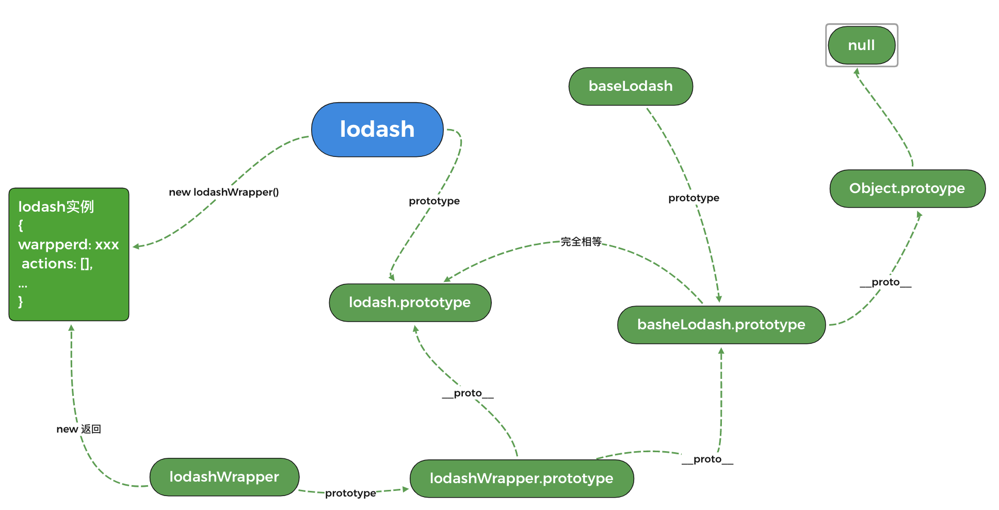
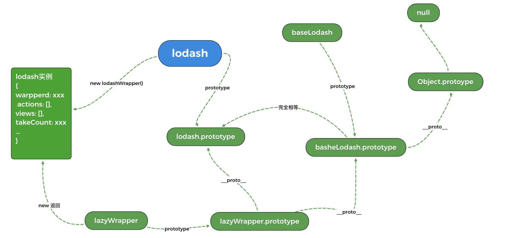

获取到`lodash-es`源码后，入口文件是`lodash.js`
```js
// ... 省略代码 一系列的方法导出
export { default } from './lodash.default.js';
```
可以看到最终导出的是`lodash.default.js`中的代码

## lodash函数
```js
function lodash(value) {
  // .. 省略
  return new LodashWrapper(value);
}
lodash.prototype = baseLodash.prototype;
lodash.prototype.constructor = lodash;
```
可以看到`lodash`内部最终是返回一个`LodashWrapper`的实例对象，并且将`lodash.prototype`设置为`baseLodash.prototype`
### LodashWrapper
::: code-group
```js [LodashWrapper.js]
function LodashWrapper(value, chainAll) {
  this.__wrapped__ = value; // 传入的值
  this.__actions__ = []; // 待执行的函数列表
  this.__chain__ = !!chainAll; // 是否支持链式调用
  this.__index__ = 0; // 函数列表中的函数执行时的索引值
  this.__values__ = undefined; // 在执行wrapperClone会wrapper.next会使用到
}
LodashWrapper.prototype = baseCreate(baseLodash.prototype);
LodashWrapper.prototype.constructor = LodashWrapper;
```
```js [wrapperClone.js]
function wrapperClone(wrapper) {
  if (wrapper instanceof LazyWrapper) {
    return wrapper.clone();
  }
  var result = new LodashWrapper(wrapper.__wrapped__, wrapper.__chain__);
  result.__actions__ = copyArray(wrapper.__actions__);
  result.__index__  = wrapper.__index__;
  result.__values__ = wrapper.__values__; // 克隆操作时，复制
  return result;
}
```
```js [wrapperNext.js]
/* var wrapped = _([1, 2]);
 *
 * wrapped.next();
 * // => { 'done': false, 'value': 1 }
 *
 * wrapped.next();
 * // => { 'done': false, 'value': 2 }
 *
 * wrapped.next();
 * // => { 'done': true, 'value': undefined }
 */
function wrapperNext() {
  if (this.__values__ === undefined) {
    this.__values__ = toArray(this.value());
  }
  var done = this.__index__ >= this.__values__.length,
      value = done ? undefined : this.__values__[this.__index__++];

  return { 'done': done, 'value': value };
}
```
:::
我们接着往上找`baseCreate`和`baseLodash`
### baseCreate
```js
function baseLodash() { // 一个空函数
  // No operation performed.
}

var objectCreate = Object.create;
var baseCreate = (function() { // 作用跟Object.create 一样
  function object() {}
  return function(proto) {
    if (!isObject(proto)) {
      return {};
    }
    if (objectCreate) {
      return objectCreate(proto);
    }
    object.prototype = proto;
    var result = new object;
    object.prototype = undefined;
    return result;
  };
}())
```
可以看到`baseCreate(proto)`的作用跟`Object.create(proto)`作用是一样的，都是创建一个以`proto`为原型的对象
总结一下`lodash`、`lodashWrapper`、`baseLodash`的关系，如下图所示:

## mixin函数
:::code-group
```js [mixin]
var mixin = (function(func) {
  return function(object, source, options) {
    // ...省略代码
    // 最终执行_mixin函数 代码在_mixin.js中
    return func(object, source, options);
  };
}(_mixin));
```
```js [_mixin.js]
function mixin(object, source, options) {
  // 取出source的key值数组
  var props = keys(source),
  // 筛选出方法名数组
  methodNames = baseFunctions(source, props);
  // 判断是否支持链式调用
  // isObject 判断不等于null 是对象或者函数
  // 如果当前object符合isObject并且原型链上没有chain属性的话或者options.chain为true，就支持链式调用
  var chain = !(isObject(options) && 'chain' in options) || !!options.chain,
  // 判断object是不是函数
      isFunc = isFunction(object);
  // 遍历方法名类似于[].forEach
  arrayEach(methodNames, function(methodName) {
    var func = source[methodName];
    // 将来源对象的方法赋值到目标对象上，静态方法
    object[methodName] = func;
    if (isFunc) { // 如果是函数的话，就赋值到原型上
      object.prototype[methodName] = function() {
        // this 就是 new lodashWrapper生成的实例
        var chainAll = this.__chain__;
        if (chain || chainAll) { // 支持链式调用的方法会进入该逻辑
          // 这部分结合lodashWrapper.js 一起看更容易理解
          // result 就是一个lodashWrapper的实例对象
          var result = object(this.__wrapped__),
          actions = result.__actions__ = copyArray(this.__actions__);
          // 加入到__actions__待执行列表中
          actions.push({ 'func': func, 'args': arguments, 'thisArg': object }); // 
          result.__chain__ = chainAll;
          return result;
        }
        // 如果不支持链式调用会直接执行
        // arrayPush 方法就是把后面的参数 arguments加到前面去
        // func.apply(object, [this.value, ...arguments])
        return func.apply(object, arrayPush([this.value()], arguments));
      };
    }
  });
  return object;
}
```
```js [LodashWrapper.js]
function LodashWrapper(value, chainAll) {
  this.__wrapped__ = value; // 传入的值
  this.__actions__ = []; // 待执行的函数列表
  this.__chain__ = !!chainAll; // 是否支持链式调用
  this.__index__ = 0; // 索引值
  this.__values__ = undefined; // 在执行wrapperClone会wrapper.next会使用到
}
```
:::code-group
`_mixin`函数的作用就是将来源对象上的可枚举的属性添加到目标对象上
- 不同的来源对象的类型会采取不同方式取出key值
  - 如果是对象的话，会采取`Object.keys`遍历获取key值
  - 对于其他类型都会采取`Object.hasOwnProperty`方式来判断获取自身属性)
- 如果目标对象是一个函数的话，就会把来源对象添加到目标对象上的原型上
::: tip
Object.keys遍历是不会遍历到原型上属性的
:::
我们接着来看下`mixin`函数调用的地方
```js
// lodash.default.js中
// ...
lodash.after = func.after;
// ...添加可以链式操作的方法
// 把lodash上的静态方法添加到lodash原型上
mixin(lodash, lodash);

lodash.add = math.add;
// ...
// 添加不能链式操作的方法到
mixin(lodash, (function() {
  var source = {};
  baseForOwn(lodash, function(func, methodName) {
    // 过滤掉已经在原型上的方法，过滤掉mixin(lodash, lodash)混入的方法
    if (!hasOwnProperty.call(lodash.prototype, methodName)) {
      source[methodName] = func;
    }
  });
  return source;
}()), { 'chain': false });
```
通过`mixin`函数进行混入之后，`lodash`原型上就包含了各种实现的方法函数
## 惰性求值
简单而言就是，当程序执行某一操作的时候，才会去进行计算结果。

特点如下:
- 延迟计算: 会把操作过程进行缓存，不会执行
- 筛选过滤: 执行过程中，会对计算结果进行操作并筛选出符合结果的计算结果
- 计算求值: 通知程序执行计算操作
### 示例代码
```js
// _ 为 lodash
const users = ['rookie', 'hhm', 'white'];
const youngest = _
  .chain(users)
  .map(function(o, index) {
    console.log(index) // 1
    return o
  })
  .take(1)
  .value()
```
执行代码，`console.log`只会执行一次且输出`1`，这里说明当lodash执行`value`方法的时候，知道最后需要多少个值，这样map就可以执行多少次，而不是全部都执行，这对于程序的性能提升很有帮助。

这里执行的`map`方法是把`lazyWrapper`原型上的方法添加到`lodash`原型上里，具体代码这里就不贴了，只贴下`lazyWrapper`的实现，具体的实现直接看源码就能理解。
### lazyWrapper
`lazyWrapper`跟`lodashWrapper`很类似
```js
function LazyWrapper(value) {
  this.__wrapped__ = value; // 传入的值参数
  this.__actions__ = []; // 待执行的函数数组(value值不是数组的时候)
  this.__dir__ = 1;
  this.__filtered__ = false; // 过滤
  this.__iteratees__ = []; // 迭代器函数数组
  this.__takeCount__ = MAX_ARRAY_LENGTH; // 实际要取几个值
  this.__views__ = []; // 包含取值的函数列表(take, takeRight, drop, dropRight)
}
// Ensure `LazyWrapper` is an instance of `baseLodash`.
LazyWrapper.prototype = baseCreate(baseLodash.prototype);
LazyWrapper.prototype.constructor = LazyWrapper;
```
`lodash`和`lazyWrapper`关系如下:


### 惰性求值实现
因为lodash关于这部分的源码比较多，所以就不直接看源码，我们来自己手动实现一个`lodash`里简化版的惰性求值，也便于理解。源码在`lodash.default.js`文件里。

我们来实现下面这样一段代码
```js
const users = ['rookie', 'lazy', 'white', 'hhm']
// lazyMan就是lodash函数
lazyMan(users)
  .filter(name => name ! == 'lazy')
  .map((name, index) => name + index)
  .take(2)
  .value()
```
可以尝试引入cdn文件，在浏览器中调试
```js
<script src="https://cdn.jsdelivr.net/npm/lodash@4.17.15/lodash.js"></script>
```
#### lazyMan
```js
function lazyMan (value) {
  return new lazyWrapper(value)
}

const MAX_ARRAY_LENGTH = 4294967295;
function lazyWrapper (value) {
  this.__wrapped__ = value
  this.__dir__ = 1
  this.__iteratees__ = [] // 迭代器数组
  this.__takeCount__ = MAX_ARRAY_LENGTH;
}
```
#### filter
```js
const LAZY_FILTER_FLAG = 1
function filter (fn) {
  this.__iteratees__.push({
    'iteratee': fn,
    'type': LAZY_FILTER_FLAG
  })
  return this
}
lazyWrapper.prototype.filter = filter
```
#### map
```js
const LAZY_MAP_FLAG = 2;
function map (fn) {
  this.__iteratees__.push({
    'iteratee': fn,
    type: LAZY_MAP_FLAG
  })
  return this
}
lazyWrapper.prototype.map = map
```
因为后续进行取值操作时，`map`与`filter`方法执行操作不同，所以会加入一个`type`来标识不同的数据操作
#### take
```js
function take (n) {
  this.__takeCount__ = n
  return this
}
lazyWrapper.prototype.map = map
```
#### value
```js
function value () {
  // 这里我们只包含value是数组的情况，实际上value也可以为对象和其他值
  const arr = this.__wrapped__ // ['rookie', 'lazy', 'white', 'hhm']
  let length = arr.length // 4
  const iteratees = this.____iteratees__ // [{ map ... }, { filter }] 存放了filter和map
  const iterLength = this.____iteratees__.length // 2
  let dir = 1
  let index = -1 // arr数组的下标
  let resIndex = 0 // 控制外层循环
  const takeCount = this.__takeCount // 2

  const result = []
  // 用来退出循环的标识outer
  // 参考链接 https://developer.mozilla.org/zh-CN/docs/Web/JavaScript/Reference/Statements/label
  outer
  while (length-- && resIndex < takeCount) {
    // 控制外层的循环
    index += dir
    // 遍历iteratees
    let iterIndex = -1
    // 取到arr中对应下标的值(原始值)
    let value = array[index]
    while (iterIndex++ < iterLength) { // 遍历循环this.____iteratees__函数
      const data = iteratees[iterIndex]
      const { type, iteratee } = data
      // 会依次取出filter/map方法来执行
      let computed = iteratee(value)
      if (type === LAZY_MAP_FLAG) { // 如果是map方法
        value = computed // rookie -> rookie1 | hhm -> hhm1 依次类推
      } else if (!computed) { // 处理不符合数据
        // 如果执行filter方法，value是lazy
        // name => name ! == 'lazy'， computed会变成false 走到下面的逻辑
        if (type === LAZY_FILTER_FLAG) {
          // 跳出当前内层的while，进入到下一步的外层循环
          // 不会执行后面的 result[iterIndex++] = value操作
          continue outer
        } else {
          // 直接退出整个循环
          break outer
        }
      }
    }
    // 找到当前符合
    result[iterIndex++] = value
  }
}
lazyWrapper.prototype.value = value
```
至此简版的惰性求值就实现了。
::: tip 总结
惰性求值的实现，主要把需要执行的函数存储下来，以及标记语句相结合，在真正取值时，只执行筛选过后的步骤，减少执行次数，从而提高代码性能
:::

