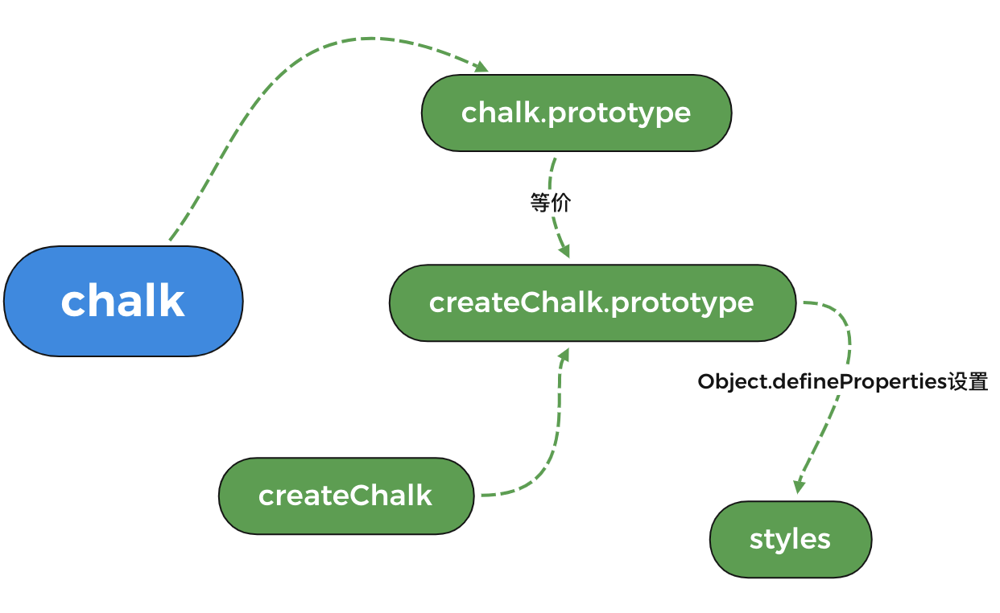

在开发前端脚手架的时候，在终端中，对于不同的提示文本会展示不同的样式来增强提示及用户体验。其中[`chalk`](https://www.npmjs.com/package/chalk)，释义为“粉笔”，它的功能就是给输出提示提供各种样式，包括文本颜色、背景色、字重等样式，并且广泛应用在许多项目中。

对这方面的实现比较好奇，本篇文章就一起来看看源码，掌握其实现原理。

## ANSI escape code
在进入源码学习之前，我们需要了解一个概念[`ANSI escape code`](https://www.detailedpedia.com/wiki-ANSI_escape_code#CSI_(Control_Sequence_Introducer)_sequences)
> 根据官方的介绍，ANSI转义码(或转义序列)是一种使用带内信号控制视频文本终端的格式、颜色和其他输出选
  项的方法。为了编码这种格式化信息，特定的字节序列被嵌入到文本中，终端将查找并将其解释为命令，而不
  是字符代码。

简而言之，`ANSI escape code`是终端上通用的通信协议标准，通过输入特定的字符序列，我们可以控制文本颜色，背景色，下划线，光标位置等。

示例代码如下：
```js
console.log('\x1b[41m rookie')
console.log('\x1b[91;47mrookie')
console.log('\x1b[0m\x1b[4mrookie')
```
- 第一个输出的字符串本文颜色会变红 <span style="color: red">rookie</span>
- 第二则会把文本颜色变红，背景颜色变白 <span style="color: red; background-color: white">rookie</span>
- 第三个会给文本添加一个下划线 <span style="text-decoration: underline;">rookie</span>

其中`\x1b[0m`是用来重置样式的，如果不使用的话，后面的样式会延续上一个的样式。

可以看到，我们通过`\x1b[`加上不同的代码后缀，就实现了文本颜色及背景颜色的控制，更多的样式及控制可以查阅`ANSI escape code`网站，这里就不一一举例了。

我们接下来看看`chalk`的一些基本用法，能够在后续源码分析的时候，更好地理解实现。分析的是`chalk^5.2.0`(使用的是ESM规范)，想调试`Commonjs`规范可以降级到`4.x.x`版本的。
## 基本用法
```js
import chalk from "chalk"
const log = console.log
chalk.red.bold.underline('debugger chalk') // debugger位置
log(chalk.red.bold.underline('rookie'))
log(chalk.rgb(123, 45, 67).underline('Underlined reddish color'))
log(chalk.hex('#DEADED').bold('Bold gray!'))
```
特点:
- 可以链式调用，并且中间的方法可以不调用，但是方法的结果会延续下去
- 使用有意义的方法名来取代了手动添加`ANS`转义字符来控制终端文本样式
- 除了支持基础的`ANSI escape code`的颜色值之外，还支持`rgb`和`hex(十六进制)`的颜色值

## 源码分析
先看下`chalk`函数创建过程
```js{13}
const chalkFactory = options => {
	const chalk = (...strings) => strings.join(' ') // 传入的参数通过空格符进行拼接
	applyOptions(chalk, options)
  // 设置chalk.prototype === createChalk.prototype
	Object.setPrototypeOf(chalk, createChalk.prototype)
	return chalk
}
function createChalk(options) { // 创建chalk函数
	return chalkFactory(options)
}

Object.setPrototypeOf(createChalk.prototype, Function.prototype)
Object.defineProperties(createChalk.prototype, styles)

const chalk = createChalk()
export default chalk
```
从上面的代码中可以看到，`chalk`是通过`工厂模式`创建的，创建流程如下：
- `chalkFactory`内部生成一个`chalk`函数
- 设置`chalk.prototype`为`createChalk.prototype`
- 最后返回`chalk`函数

其中`createChalk.prototype`的值又是通过<span class="highlight">styles</span>变量赋值所得的。

### styles
:::code-group
```js [index.js]
import ansiStyles from '#ansi-styles';
const styles = Object.create(null);

for (const [styleName, style] of Object.entries(ansiStyles)) {
  styles[styleName] = {
	get() {
      const builder = createBuilder(this, createStyler(style.open, style.close, this[STYLER]), this[IS_EMPTY]);
      Object.defineProperty(this, styleName, {value: builder});
      return builder;
    }
  };
}
// ... 省略代码
```
```js [#ansi-styles]
// 删减了一些代码
const styles = { // 定义了ANSI码跟变量名的映射关系
	modifier: { // 修饰符
		reset: [0, 0],
		bold: [1, 22],
		// ...
	},
	color: { // 文本颜色
		black: [30, 39],
		red: [31, 39],
		// ...
	},
	bgColor: { // 背景颜色
		bgBlack: [40, 49],
		bgRed: [41, 49],
    // ...
	},
};

function assembleStyles() { // 把每个组别的key都挂载到styles对象上
  for (const [groupName, group] of Object.entries(styles)) {
    for (const [styleName, style] of Object.entries(group)) {
      styles[styleName] = {
        open: `\u001B[${style[0]}m`, // 最后生成ANSI CODE
        close: `\u001B[${style[1]}m`,
      };
    }
  }
  styles.color.close = '\u001B[39m'; // 默认的前景色
  styles.bgColor.close = '\u001B[49m'; // 默认的后景色
  return styles;
}
const ansiStyles = assembleStyles();
export default ansiStyles;
```
:::
先看顶部的`import`语句引入`#`开头的文件，大家可能会对这段感到疑惑，不过在`package.json`中有这么一段设置，支持了设置引入文件路径的别名
```json
{
  "imports": {
    "#ansi-styles": "./source/vendor/ansi-styles/index.js", // 指明引入的路径
    "#supports-color": {
      "node": "./source/vendor/supports-color/index.js", // node环境中引入路径
      "default": "./source/vendor/supports-color/browser.js"
    }
  }
}
// 从这里我们知道，可以通过设置`imports`能够给文件路径设置别名。
```
在`#ansi-styles`文件中，可以看到`styles`对象定义了`modifier color bgColor`三个组别，执行`assembleStyles`函数会把每个组别中的`key`挂载到`styles`对象上，最后拿到导出的`ansiStyles`对象如下:
```js
{
  bold: { open: '\u001B[1m', close: '\u001B[22m' }, // 字体样式
  // ..
  red: { open: '\u001B[31m', close: '\u001B[39m' }, // 文本样式
  // ..
  bgRed: { open: '\u001B[41m', close: '\u001B[49m' } // 背景样式
}
```
- 每一个对象中的`open`代表渲染开始标签，`close`代表结束渲染的标签
- `\u001B`跟`\x1B`表示的是一个意思，是等价关系，只是编码格式不同

拿到了`ansiStyles`，通过`for`循环遍历，将值挂载到`styles`上
```js
const ansiStyles = {
  bold: { open: '\u001B[1m', close: '\u001B[22m' }, // 字体样式
  // ..
  red: { open: '\u001B[31m', close: '\u001B[39m' }, // 文本样式
  // ..
  bgRed: { open: '\u001B[41m', close: '\u001B[49m' } // 背景样式
}
for (const [styleName, style] of Object.entries(ansiStyles)) {
  styles[styleName] = {
	get() {
      // ....
    }
  };
}

// 最后生成的styles对象如下
{
  // ...
  bold: {
    get() {}
  },
  red: {
    get() {}
  },
  bgRed: {
    get() {}
  }
}
```
之前在创建`chalk`的时候，有设置原型链的方法
```js
Object.defineProperties(createChalk.prototype, styles)
Object.setPrototypeOf(chalk, createChalk.prototype)
```
- 先通过`Object.defineProperties`，设置了`createChalk.prototype`对象上每个属性的`getter`，代码如下：
  ```js
  Object.defineProperties(createChalk.prototype, {
    bold: {
      get() {}
    },
    red: {
      get() {}
    },
    bgRed: {
      get() {}
    }
  })
  // 这意味着chalk.bold就会触发get方法
  ```
- `chalk.prototype` === `createChalk.prototype`

所以，`chalk`函数上就能够直接使用`styles`对象上的所有方法了，比如`chalk.red`、`chalk.bold`等等。

`styles`、`chalk`、`createChalk`关系图如下：


现在已经知道`chalk`函数是如何能够直接使用方法了，接下来看看在调用方法的时候具体做了什么事情

在设置方法的时候`get`内部实现如下：
```js
styles[styleName] = {
  get() {
    const builder = createBuilder(
      this, // 调用该函数的对象
      createStyler(style.open, style.close, this[STYLER]), // 渲染标签对象
      this[IS_EMPTY]
    )
    Object.defineProperty(this, styleName, { value: builder })
    return builder;
  }
}
```
可以看执行`chalk.red`的时候，会执行`createBuilder`，并传入`createStyler`函数生成的结果，最后返回`builder`
### createStyler
```js
const createStyler = (open, close, parent) => {
	let openAll;
	let closeAll;
	if (parent === undefined) {
    // 如果是 chalk.red('2323') ，没有parent 直接返回red的渲染标签
		openAll = open;
		closeAll = close;
	} else {
    // 如果是 chalk.bold.red('2323')，parent存在
    // 就会把bold的渲染标签跟red的渲染标签拼接起来
		openAll = parent.openAll + open;
		closeAll = close + parent.closeAll;
	}

	return { open, close, openAll, closeAll, parent };
};
```
该函数的作用就是根据存不存在`parent`来，拼接渲染的起始和结束标签。
### createBuilder
用来处理渲染文本的逻辑，也起到了继承的作用
```js
const GENERATOR = Symbol('GENERATOR');
const STYLER = Symbol('STYLER');
const IS_EMPTY = Symbol('IS_EMPTY');

const createBuilder = (self, _styler, _isEmpty) => {
	// Single argument is hot path, implicit coercion is faster than anything
	const builder = (...arguments_) => applyStyle(
    builder,
    (arguments_.length === 1) 
      ? ('' + arguments_[0])
      : arguments_.join(' ')
  ) // 真正执行渲染文本的处理逻辑
	Object.setPrototypeOf(builder, proto); // 设置原型链，从而能够链式调用
	builder[GENERATOR] = self; // 父级调用对象
	builder[STYLER] = _styler; // 设置父级的渲染标签
	builder[IS_EMPTY] = _isEmpty;

	return builder;
};

const proto = Object.defineProperties(() => {}, {
  ...styles
});
```
从这里我们就知道`chalk`的<span class="highlight">链式调用的原理</span>就是通过`Object.setPrototypeOf(builder, proto);`设置了`builder`的原型链从而获得了`styles`对象上的所有方法。

我们结合下面代码来，一步步拆分:
```js
chalk.bold.red('rookie')
```
第一次执行`chalk.bold`，返回一个`builder1`
```js
const builder = () => { applyStyle(...) }
builder1[GENERATOR] = chalk // chalk函数调用的bold方法
builder1[STYLER] = {
  open: '\u001B[1m',
  close: '\u001B[22m',
  openAll: '\u001B[1m',
  closeAll: '\u001B[22m',
  parent: undefined
}
builder1[IS_EMPTY] = undefined
```
接着执行`builder1.red`，此时`this`指向`builder1`，先执行`createStyler`将父子渲染标签拼接起来，生成一个`builder2`
```js
builder2[GENERATOR] = builder1 // builder1函数调用的red方法生成
builder2[STYLER] = {
  open: '\u001B[1m',
  close: '\u001B[22m',
  openAll: '\u001B[1m\u001B[31m', // 把bold跟red起始渲染标签拼接
  closeAll: '\u001B[22m\u001B[39m', // 把bold跟red结束渲染标签拼接
  parent: undefined
}
builder2[IS_EMPTY] = undefined
```
最后执行`builder2('rookie')`开始处理渲染文本逻辑，调用了`applyStyle`

链式调用关系: `chalk` -> `builder1` -> `builder2` -> .... -> `builderN`
### applyStyle
```js
const builder = (...arguments) =>
  applyStyle(
    builder,
    (arguments_.length === 1) ? ('' + arguments_[0]) : arguments_.join(' ')
  );
```
可以看到`applyStyle`传入的参数，第一个是`builder`，第二个是一个字符串，多余两个参数就用`空格`拼接起来。
```js 
// 两个参数及其以上的情况
chalk.red('name', 'is', 'rookie')
// 会输出name is rookie 
// 而不是nameisrookie
```
```js
const applyStyle = (self, string) => {
  let styler = self[STYLER];
  if (styler === undefined) {
    return string;
  }
  const { openAll, closeAll } = styler;
  // 处理字符串中含有'\u001B'的情况
  if (string.includes('\u001B')) {
    while (styler !== undefined) {
      string = stringReplaceAll(string, styler.close, styler.open);

      styler = styler.parent;
    }
  }
  // 处理字符串中含有'\n'换行符的情况
  const lfIndex = string.indexOf('\n');
  if (lfIndex !== -1) {
    string = stringEncaseCRLFWithFirstIndex(string, closeAll, openAll, lfIndex);
  }
  return openAll + string + closeAll;
};
```
就我们当前例子`chalk.bold.red('rookie')`而言，`applyStyle`执行的结果如下：

`\u001B[1m\u001B[31mrookie\u001B[39m\u001B[22m'` -> 渲染成 <span style="font-weight:bold;color:red">rookie</span>

#### 处理\u001B
```js
export function stringReplaceAll(string, substring, replacer) {
  // substring: styler.close
  // replacer: styler.open
	let index = string.indexOf(substring);
	if (index === -1) {
		return string;
	}

	const substringLength = substring.length;
	let endIndex = 0;
	let returnValue = '';
	do {
		returnValue += string.slice(endIndex, index) + substring + replacer;
		endIndex = index + substringLength;
		index = string.indexOf(substring, endIndex);
	} while (index !== -1);

	returnValue += string.slice(endIndex);
	return returnValue;
}
```
执行逻辑如下：
- 首先会在字符串中找到当前字符串的是否存在渲染结束标签，如果存在就直接返回原值(不存在结束渲染标签就不会影响当前渲染)
- 会在`渲染结束标签`的后面直接加上一个`渲染开始标签`，最后返回拼接后的字符串
  ```js
  // 示例代码
  chalk.red('rookie\u001B[39mrookie')
  // 最后经过处理返回 伪代码
  // <open-tag>rookie</close-tag><open-tag>rookie</close-tag>
  ```
假如我们将该处理函数注释掉的话，下面的代码，只有第一个`rookie`会变红，第二个就显示默认的文本颜色，`\u001B[39m`相当于一个渲染结束标签
```js
console.log(chalk.red('rookie\u001B[39mrookie'))
// 返回的伪代码
// <open-tag>rookie</close-tag>rookie</close-tag>
```
:::tip
- 终端在处理文本样式的时候，只有遇到了渲染开始标签才会去渲染文本。
- 如果在这之前已经遇到了渲染结束标签，结束标签之后又没有用渲染开始标签包裹的话，那么之后的文本都不会进行样式渲染
:::
#### 处理\n
```js
// 这么处理是为了兼容问题 参考 https://github.com/chalk/chalk/pull/92
function stringEncaseCRLFWithFirstIndex(string, prefix, postfix, index) {
  let endIndex = 0;
  let returnValue = '';
  do {
    const gotCR = string[index - 1] === '\r';
    returnValue += string.slice(endIndex, (gotCR ? index - 1 : index)) + prefix + (gotCR ? '\r\n' : '\n') + postfix;
    endIndex = index + 1;
    index = string.indexOf('\n', endIndex);
  } while (index !== -1);

  returnValue += string.slice(endIndex);
  return returnValue;
}
```
从代码中可以看到，会将含有`\n`或者`\r\n`的字符串通过`prefix(结束渲染标签)`和`postfix(开始渲染标签)`包裹起来，如下:
```js
chalk.red('rookie\nrookie')
// 伪代码表示
// <open-tag>rookie</close-tag>\n<open-tag>rookie</close-tag>
```

::: tip 替代方案
可以使用[`picocolors
`](https://www.npmjs.com/package/picocolors)替代`chalk`来满足基本功能
:::

## 总结
至此，`chalk`的总体流程就已经分析完了，其他的功能基本都是上面看到的几种函数的结合。其中链式调用实现方式很巧妙:

通常接触比较多的链式调用都是需要进行函数调用，然后返回实例对象，比如`Promise`，但是`chalk`巧妙的通过`Object.defineProperties`跟拦截`getter`的方式实现，可以不通过函数调用，也把上一层的一些属性传递下去，到最后求值的时候使用。
```js
// Promise链式调用
Promise.then(() => {}).then(() => {}).finally(() => {})

// chalk
chalk.red.underline.bold.bgRed('rookie')
```

## 参考链接
- [通过Ansi Escape Codes酷炫玩转命令行](https://juejin.cn/post/6844903513852493832)
- [detailedpedia](https://www.detailedpedia.com/wiki-ANSI_escape_code#CSI_(Control_Sequence_Introducer)_sequences)


