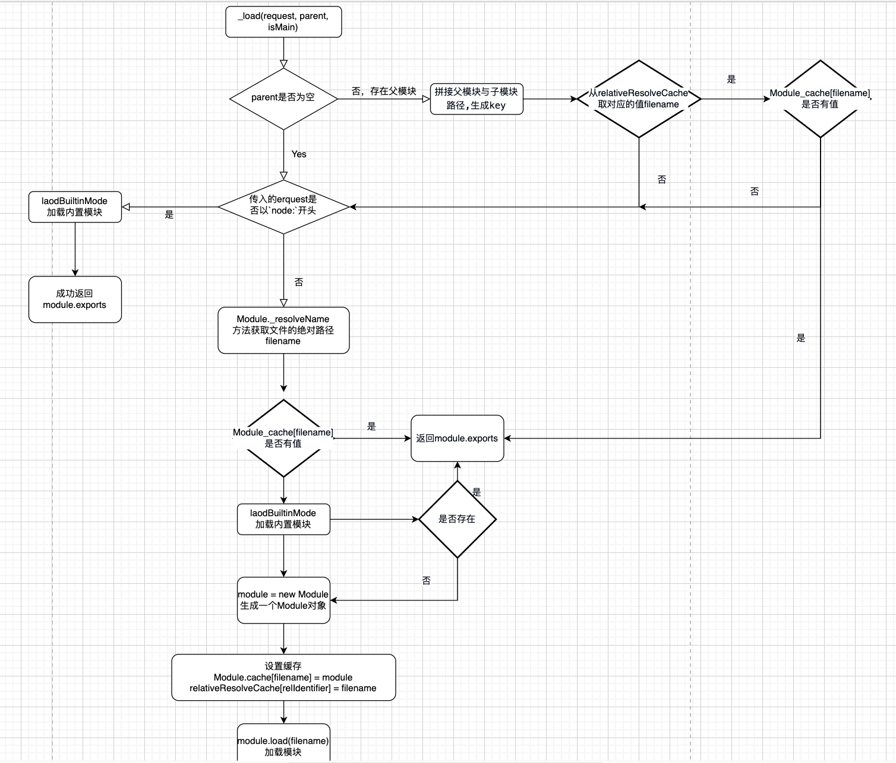
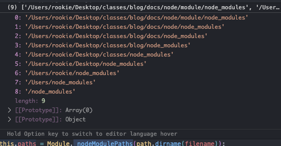
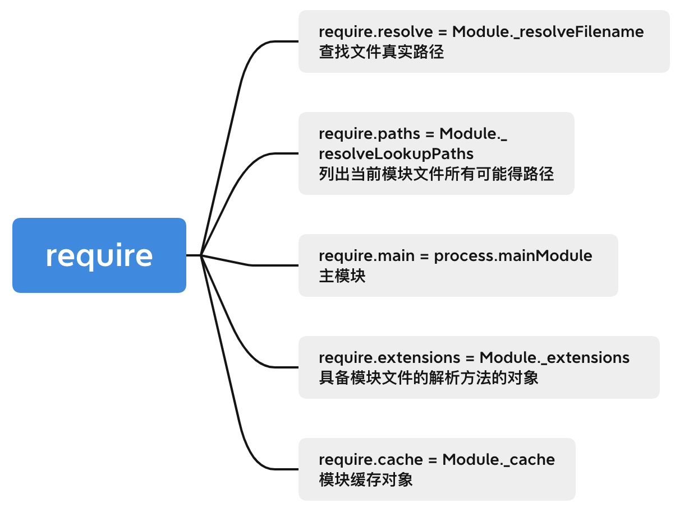

以下面代码为例，加载`a.js`文件，来剖析`require`执行流程
:::code-group
```js [main.js]
// file 1.本地模块 2.node原生模块 3.node_module模块
const file = './a.js'
// const file = 'fs'
// const file = 'detect-port' 
require(file) // 在此处断点
```
```js [a.js]
console.log('a.js')
let a = 1
exports.plus = function () {
  a++
}
exports.get = function () {
  return a
}
exports.a = a
```
:::
:::tip
- 特别注意，其中`main.js`是主模块，`a.js`是子模块，此时执行`require`是会进入加载子模块的逻辑中
- 后续截取的代码片段会有些删减，但不影响主流程
:::

通过调试，进入断点后，会直接进入到下面的代码中
```js{8}
function makeRequireFunction(mod, redirects) {
  const Module = mod.constructor;
  let require;
  if (redirects) {
    // ...
  } else {
    require = function require(path) {
      return mod.require(path); // 进入到当前代码
    };
  }
  // ...
  return require;
}
```
`mod`是一个模块对象`Module`的实例，`path`参数就是传入的`file`字符串，`mod.require`方法是在`Module.prototype`原型上的方法，我们先来了解下`Module`模块的实现
## Module
::: code-group
```js [Module]
function Module(id = '', parent) {
  this.id = id; // 文件id
  this.path = path.dirname(id); // 文件所在目录
  setOwnProperty(this, 'exports', {}); // 设置导出值
  moduleParentCache.set(this, parent);
  updateChildren(parent, this, false); // 添加子模块的方法
  this.filename = null; // 加载文件的绝对路径
  this.loaded = false; // 模块是否加载完成
  this.children = []; // 子模块的列表(每一个元素都是一个Module实例)
}
```
```js [updateChildren]
function updateChildren(parent, child, scan) {
  // 子模块不在父模块中，并且scan为true，才会将子模块加入到父模块中
  const children = parent?.children;
  if (children && !(scan && ArrayPrototypeIncludes(children, child)))
    ArrayPrototypePush(children, child);
}
```
:::
在加载模块的过程中先执行了`mod.require(path)`方法，实现如下:
### Module.prototype.require
```js
Module.prototype.require = function(id) {
  // 传入的path 必须是字符串，不是的话会抛出错误
  validateString(id, 'id');
  if (id === '') { // 不能为空字符串
    throw new ERR_INVALID_ARG_VALUE('id', id, 'must be a non-empty string');
  }
  requireDepth++;
  try {
    // 最终调用_load方法加载模块
    return Module._load(id, this, /* isMain */ false);
  } finally {
    requireDepth--;
  }
};
```
### Module.prototype._load
```js
const relativeResolveCache = ObjectCreate(null);
// ....
Module._load = function(request, parent, isMain) {
    // request: 当前传入的字符串(文件路径)
    // parent: 父模块
    // false : 是不是主模块
  let relResolveCacheIdentifier;
  if (parent) { // 如果有父模块，说明当前加载的是子模块
    // 生成一个文件路径的key，把父模块跟子模块路径进行拼接
    // relResolveCacheIdentifier: '/Users/rookie/Desktop/classes/blog/docs/node/module./a.js'
    relResolveCacheIdentifier = `${parent.path}\x00${request}`;
    // 在缓存对象中查找文件拼接路径key， 查出filename(文件的绝对路径)
    const filename = relativeResolveCache[relResolveCacheIdentifier];
    if (filename !== undefined) { // 查找到了，说明之前已经加载过了一次
      // 在缓存模块中，根据key，寻找对应的缓存模块对象
      const cachedModule = Module._cache[filename];
      if (cachedModule !== undefined) { // 找到了缓存
        updateChildren(parent, cachedModule, true); // 更新子模块
        return cachedModule.exports; // 导出exports属性 就是我们平时用的module.exports
      }
      delete relativeResolveCache[relResolveCacheIdentifier];
    }
  }

  if (StringPrototypeStartsWith(request, 'node:')) { // 兼容这种情况 const fs = require('node:fs') 内置模块
    // Slice 'node:' prefix
    // 解析'node:fs' -> 'fs'
    const id = StringPrototypeSlice(request, 5);

    const module = loadBuiltinModule(id, request); // 加载内置模块
    if (!module?.canBeRequiredByUsers) {
      throw new ERR_UNKNOWN_BUILTIN_MODULE(request);
    }
    // 如果是内置模块，直接返回
    return module.exports;
  }

  // 找到加载文件在文件系统中的绝对路径
  const filename = Module._resolveFilename(request, parent, isMain);
  const cachedModule = Module._cache[filename];
  if (cachedModule !== undefined) { // 判断有没有在Module.cache对象中存在
    updateChildren(parent, cachedModule, true); // 更新子模块
    return cachedModule.exports;
  }

  // 查找内置模块
  const mod = loadBuiltinModule(filename, request);
  if (mod?.canBeRequiredByUsers &&
      BuiltinModule.canBeRequiredWithoutScheme(filename)) {
    return mod.exports;
  }

  // 创建一个模块对象(不是内置模块)
  const module = cachedModule || new Module(filename, parent);

  if (isMain) { // 针对主模块
    process.mainModule = module;
    module.id = '.';
  }

  // 设置缓存
  Module._cache[filename] = module;
  if (parent !== undefined) {
    // filename: '/Users/rookie/Desktop/classes/blog/docs/node/module/a.js'
    relativeResolveCache[relResolveCacheIdentifier] = filename;
  }
  // 调用Module.prototype.load
  module.load(filename);
  return module.exports;
};
```
可以看到`relativeResolveCache`是一个**文件路径跟文件路径**的映射，`Module._cache`是一个**文件路径跟模块对象**的映射，总结下`_load`执行流程：
1. 当前加载模块为子模块(父模块直接跳过，执行下一步)
     - 拼接父子模块的路径，生成一个文件标识`relResolveCacheIdentifier`
     - 从`relativeResolveCache`中查找`relResolveCacheIdentifier`，对应的`filename`，没有则跳到下一步
       - 找到了`filename`，则通过`Module._cache[filename]`，查找缓存的模块(module)
       - 找到了缓存模块就返回module.exports，没有则跳到下一步
2. 如果传入的值是以`node:`开头，则去调用`loadBuiltinModule`加载内置模块
     - 成功则返回`module.exports`，找不到会报错
3. 通过`Module._resolveFilename`方法找到文件的绝对路径(filename)
4. 先从`Module._cache[filename]`，查找缓存模块，找到就返回`module.exports`
5. 通过`loadBuiltinModule`加载内置模块，找到返回`module.exports`
6. 通过`new Module`生成一个`module`实例
     - `Module.cache` = `filename`
     - `relativeResolveCache[relResolveCacheIdentifier]` = `filename`
     - module.load(filename)加载模块
7. 返回module.exports

<!--  -->


简而言之，就是先从缓存`Module.cache`缓存中查找模块，如果找到就返回`module.exports`，没找到就会去查找内置模块，内置模块没找到就会通过`new Module`一个新的模块实例，再去执行`module.load`加载模块

`Module._resolveFilename`方法会找到传入文件在文件系统中的绝对路径，我们在后续篇章中进行分析，

### Module.prototype.load
```js
Module.prototype.load = function(filename) {
  this.filename = filename;
  // 找到所有可能的node_modules目录
  this.paths = Module._nodeModulePaths(path.dirname(filename));
  // 找到文件的后缀名
  const extension = findLongestRegisteredExtension(filename);
  // 执行模块代码
  Module._extensions[extension](this, filename);
  // 加载完成
  this.loaded = true;
};
```
`paths`的值是这样的，`extension`就是文件的后缀名，最后执行`Module._extensions[extension](this, filename)`执行代码，这个方法针对不同的文件后缀会执行不同的操作，我们后续分析该方法。
### Module._extension
处理不同的模块文件
```js
// 处理.js文件
Module._extensions['.js'] = function(module, filename) {
  // If already analyzed the source, then it will be cached.
  const content = fs.readFileSync(filename, 'utf8');
  // ... 省略代码
  module._compile(content, filename);
};

// 处理.json文件
Module._extensions['.json'] = function(module, filename) {
  const content = fs.readFileSync(filename, 'utf8');
  // ... 省略代码
  // 
  // 直接设置module.exports的值
  setOwnProperty(module, 'exports', JSONParse(stripBOM(content)))
}

// 加载c++的文件
Module._extensions['.node'] = function(module, filename) {
  // ... 省略代码
  return process.dlopen(module, path.toNamespacedPath(filename));
};
```
#### 解析json
对于`.json`文件而言，通过`JSONParse`方法解析通过`fs`读取的文件内容，简单实现如下:
:::code-group 
```js [main.js]
const fs = require('fs')
const path = require('path')
const filename = path.resolve(__dirname, './test.json')
const content = fs.readFileSync(filename, 'utf-8')
console.log(JSON.parse(content)) // { a: "1" }
```
```json [test.json]
{
  "a": "1"
}
```
:::
对于`.js`文件而言会执行`Module.prototype._compile`方法
#### 解析js文件
```js
Module.prototype._compile = function(content, filename) {
  let redirects;
  // 生成一个可执行的函数，执行文件中的代码
  const compiledWrapper = wrapSafe(filename, content, this);
  const dirname = path.dirname(filename); // 获取当前目录名
  const require = makeRequireFunction(this, redirects); // 设置require
  let result;
  const exports = this.exports;
  const thisValue = exports;
  const module = this
  // 执行compiledWrapper
  // 并传入了exports require module filename dirname
  ReflectApply(
    compiledWrapper,
    thisValue,
    [exports, require, module, filename, dirname]
  )
  return result;
};
```
`makeRequireFunction`会把`Module`上的一些对象挂到`require`函数上：

其中`compiledWrapper`函数展示如下:

```js
ƒ (exports, require, module, __filename, __dirname) {
  console.log('a.js')
  let a = 1
  exports.plus = function () {  a++}
  exports.get = function () {  return a}
  exports.a = a
}
```
其中`exports, require, module, __filename, __dirname`参数对应了，执行时传入的变量

执行`js`文件流程:
- 先执行`wrapSafe`函数生成一个可执行的函数`compiledWrapper`，相当于在代码内容外面套了一个`function`
- 最后会执行`compiledWrapper`函数，这样就会执行所加载文件的代码逻辑，并且在执行模块代码时
::: tip 注意
执行代码时会传入`exports`、`require`、`module`、`filename`、`dirname`几个参数。这也是为什么我们能够在模块中直接使用这些变量的原因，这些变量都作为变量注入到代码块中了。
:::
解析`js`文件的简单实现如下:
```js
const compileFunction = (content) => { // 返回一个Function
  return new Function(
    'exports',
    'require',
    'module',
    '__filename',
    '__dirname',
    content
  )
}
const filename = path.resolve(__dirname, 'a.js') // 当前文件
const dirname = path.dirname(filename) // 当前文件目录
const content = fs.readFileSync(filename, 'utf-8')
// 模块
const compiledWrapper = compileFunction(content, filename)
const thisValue = module.exports
// 执行函数
Reflect.apply(compiledWrapper, thisValue, [
  exports, require, module, filename, dirname
])
```
## require执行流程总结
- `require`方法执行的是`Module.prototype.require`
  - 校验传入的参数，校验失败返回错误，成功调用该`Module.prototype._load`
- module._load
  - `relativeResolveCache[relResolveCacheIdentifier]` 查找文件映射 `filename`
  - `Module.cache[filename]` 查找缓存模块
    - 查到返回`module.exports`
  - `Module.resolveFilename[filename]` 查找模块的真实路径
    - 查到返回`module.exports`
  - `Module.cache[filename]` 查找缓存模块
    - 查到返回`module.exports`
  - `loadBuiltInModule` 查找内置模块
    - 查到返回`module.exports`
  - `new Module` 生成`module`
  - 设置`module.cache` 缓存
  - 执行`module.load` 加载模块
- module.load
  - `findLongestRegisteredExtension` 查找文件后缀名
  - `Module._extensions[extension](this, filename)` 执行对应文件的模块
- Module._extensions处理文件类型
  - json文件，通过`JSON.parse`解析出`value`，并将`value`赋值给`module.exports`
  - js文件(Module.prototype._compile)
    - 将代码内容通过`function`包裹起来，生成一个`wrapperFunction`
    - 执行`wrapperFunction`，并将模块中用到的变量传入，执行代码逻辑

