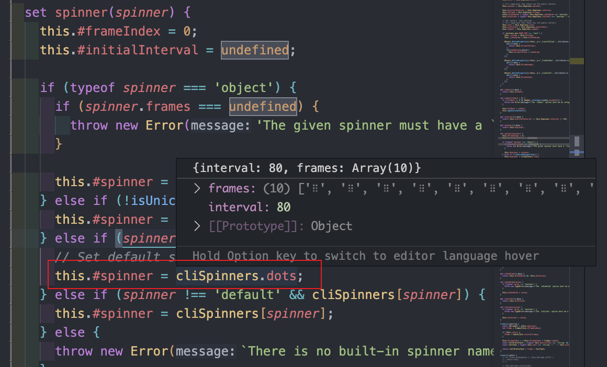

前端脚手架开发中，在执行耗时操作时，常常需要设置一些提示信息或者加载样式来优化体验，其中[`ora`](https://www.npmjs.com/package/ora)每周达到了惊人的上千万下载量，学习其中的实现方式能够帮助开发者更好地使用和理解，话不多说，我们开始今天的学习。

## 基本用法
```js
import ora from 'ora'
const spinner = ora('Loading unicorns').start();
setTimeout(() => {
	spinner.color = 'yellow';
	spinner.text = 'Loading rainbows';
}, 5000);

setTimeout(() => {
  spinner.stop()
}, 10000)
```
显示结果如下:

<video controls autoplay="autoplay">
<source src="/images/ora.mp4">
</video>

特点:

- 能在loading过程中改变loading的样式与文案
- 在loading过程中，如果此时在终端进行输入，输入的文案不会加到`loading`后面而是会缓存起来，当loading结束后会显示在命令行中

我们带着这两个主要特点来理清`ora`执行的大致流程以及比较常用的方法。

## 执行流程分析
导出的函数代码如下：
```js
export default function ora(options) {
	return new Ora(options);
}
```
可以看到，最终是通过执行`new Ora`返回实例对象，所以我们重点看下`Ora`的实现
```js
class Ora {
  // ... 私有变量定义
  #options
  constructor(options) {
    // 关键部分，在loading过程中阻止输入
    if (!stdinDiscarder) {
      stdinDiscarder = new StdinDiscarder();
    }
    if (typeof options === 'string') {
      options = {
        text: options,
      };
    }
    this.#options = {
      color: 'cyan',
      stream: process.stderr,
      discardStdin: true,
      hideCursor: true,
      ...options,
    };
    this.color = this.#options.color;
    this.spinner = this.#options.spinner;
    this.text = this.#options.text;
    this.prefixText = this.#options.prefixText;
    this.indent = this.#options.indent;
    // .. 设置私有变量，比较多就不一一贴出来了
  }
}
```
`Ora`初始化部分主要做两件事情:
- 通过传入的参数设置内部的私有变量的值
- 其中关键功能，是通过`StdinDiscarder`方法，缓存在loading过程中的输入(在loading过程中的值，在loading结束之后才会写入到终端上)

### StdinDiscarder
```js
import process from 'node:process';
import readline from 'node:readline';
import {BufferListStream} from 'bl';
const ASCII_ETX_CODE = 0x03; // Ctrl+C emits this code
export class StdinDiscarder {
	#requests = 0;
	#mutedStream = new BufferListStream();
	#rl;
	constructor() {
		this.#mutedStream.pipe(process.stdout);
    // 把标准输出流放入到Buffer中缓存起来
	}
	start() {
		this.#requests++;
		if (this.#requests === 1) {
      // 开始进行监听行输入
			this._realStart();
		}
	}
	stop() {
		this.#requests--;
		if (this.#requests === 0) {
			this._realStop();
		}
	}
	_realStart() {
    // 开启一个readline实例
		this.#rl = readline.createInterface({
			input: process.stdin, // 标准输入
			output: this.#mutedStream, // 输出
		});
    // 当前监听到中断的信号, ctrl+c
		this.#rl.on('SIGINT', () => {
      // 如果当前进程监听该事件的监听数量为0
			if (process.listenerCount('SIGINT') === 0) {
				process.emit('SIGINT');
			} else {
        // 不为零 退出readline 杀死程序
				this.#rl.close();
				process.kill(process.pid, 'SIGINT');
			}
		});
	}
	_realStop() {
    // 关闭readline
		this.#rl.close();
		this.#rl = undefined;
	}
}
```
- `StdinDiscarder`初始化过程中，将`process.stdout`通过管道放入到了`BufferListStream`的缓存区(`mutedStream`)中
- 在`start`过程中会开启一个`readline`用来监听终端行输入的实例，输入是`process.stdin`(就是我们在命令行中输入的文案)，输出是`mutedStream`而不是`process.stdout`
所以，这个时候当我们在命令行中输入文案时，这些数据都会放入缓存区中，而不是直接显示在命令行中。关于[`BufferListStream`](https://www.npmjs.com/package/bl)的实现，感兴趣的可以看下。

### start
初始化`Ora`完成之后，执行`ora.start()`方法开启`loading`
```js
class Ora {
  // ....
  start(text) {
    if (text) {
      this.text = text;
    }
    if (this.#isSilent) { // 设置了静默模式，就不展示loading
      return this;
    }
    if (this.#options.hideCursor) { // 是否隐藏光标
      cliCursor.hide(this.#stream);
    }
    if (this.#options.discardStdin && process.stdin.isTTY) { // 判断是不是终端
      this.#isDiscardingStdin = true;
      // stdinDiscarder = new StdinDiscarder();
      stdinDiscarder.start(); // 创建一个readline实例，监听命令行输入
    }
    // 执行render开始渲染初始动画帧
    this.render();
    // 开启定时器，不断的渲染帧
    this.#id = setInterval(this.render.bind(this), this.interval);
    return this;
  }
}
```
`start`逻辑也比较清晰，`render`函数是真正实现`loading`效果的，其中[`cliCursor`](https://www.npmjs.com/package/cli-cursor)这个库可以实现命令行光标的展示和隐藏，本质上也是通过`Ansi Escape Codes`实现的。

### render
```js
render () { // 渲染loading样式
  if (this.#isSilent) { // 静默状态就直接返回
    return this;
  }
  this.clear(); // 清屏操作，把上一帧清空
  this.#stream.write(this.frame()); // 写入当前帧
  // process.stderr.write(this.frame())
  this.#linesToClear = this.#lineCount; // 需要清空的行数
  return this;
}
```
#### clear
渲染样式的过程，先执行清屏操作`clear`
```js
clear() { // 清屏操作
  this.#stream.cursorTo(0); // 把光标移动到当前行的最前面
  for (let index = 0; index < this.#linesToClear; index++) {
    if (index > 0) { // 对于多行的情况比如说加了 \n换行符
      // 需要将光标向上移动一行
      this.#stream.moveCursor(0, -1); // 0: 水平方向 -1: 垂直方向
    }
    // http://nodejs.cn/api-v18/readline/readline_clearline_stream_dir_callback.html
    // 1: 代表从光标右边开始删除信息
    this.#stream.clearLine(1);
  }
  // 不设置的话 #indent 默认为零，lastIndent同理也是零
  if (this.#indent || this.lastIndent !== this.#indent) {
    this.#stream.cursorTo(this.#indent);
  }
  this.lastIndent = this.#indent;
  this.#linesToClear = 0;

  return this;
}
```
#### frame
清屏操作完成之后，就会进行图案的绘制
```js 渲染每一帧的图画
frame() { // 渲染帧
  const {frames} = this.#spinner;
  // 初始值 this.#frameIndex 为0
  // 获取当前帧
  let frame = frames[this.#frameIndex];

  if (this.color) {
    // 通过chalk设置文本颜色
    frame = chalk[this.color](frame);
  }
  // 遇余操作，不断地循环frameIndex，从而获取不同索引下的的图画
  this.#frameIndex = ++this.#frameIndex % frames.length;
  const fullPrefixText = (typeof this.#prefixText === 'string' && this.#prefixText !== '') ? this.#prefixText + ' ' : '';
  const fullText = typeof this.text === 'string' ? ' ' + this.text : '';

  return fullPrefixText + frame + fullText;
}
```
`this.#spinner`默认会取`cliSpinners.dots`([`cliSpinners`](https://www.npmjs.com/package/cli-spinners)是一个终端的样式库)


#### stop
当我们需要对动画进行暂停的时候需要执行`stop`方法
```js
stop() {
  clearInterval(this.#id); // 终止绘制的定时器
  this.#id = undefined;
  this.#frameIndex = 0;
  this.clear(); // 清屏
  if (this.#options.hideCursor) {
    // 如果一开始设置了隐藏光标，需要在结束之后把光标恢复
    // 否则就会出现光标不见的问题
    cliCursor.show(this.#stream);
  }

  if (this.#options.discardStdin && process.stdin.isTTY && this.#isDiscardingStdin) {
    stdinDiscarder.stop(); // 终止readline的监听
    this.#isDiscardingStdin = false;
  }

  return this;
}
```
至此，`ora`的渲染主体流程就比较清晰明了了，接下来我们来手动实现一个简易版本的，加深印象。
## 简单实现
```js
import readline from 'node:readline'
import {BufferListStream} from 'bl';
const spinner = { // 定义帧动画
  frames: ['-', '|', '/', '\\', '\/'],
  interval: 80
}
let stdinDiscarder // 丢弃输入

class Ora {
  #text = ''
  constructor(text) {
    stdinDiscarder = new StdinDiscarder()
    this.frameIndex = 0
    this.text = text
    this.stream = process.stderr
  }
  set text(value) { // 设置文本
    this.#text = value
    this.updateLineCount()
  }
  get text() {
    return this.#text
  }
  updateLineCount() { // 设置行数
    this.clearLineCount = this.text.split('\n').filter(Boolean).length // 以换行符分割
  }
  start(text) {
    stdinDiscarder.start()
    this.render() // 初始化渲染
    this.timer = setInterval(this.render.bind(this), spinner.interval)
    return this
  }
  render() {
    this.clear()
    process.stderr.write(this.frame())
  }
  frame() {
    const frames = spinner.frames[this.frameIndex]
    this.frameIndex = ++this.frameIndex % spinner.frames.length
    return frames + this.text
  }
  clear() { // 只针对单行
    this.stream.cursorTo(0)
    for (let index = 0; index < this.clearLineCount; index++) {
      if (index > 0) {
        this.stream.moveCursor(0, -1)
      }
      this.stream.clearLine(1) // 从光标的右侧开始删除
    }
  }
  stop() {
    this.timer && clearInterval(this.timer) // 暂停定时器
    this.clear(); // 清屏
    stdinDiscarder.stop() // 终端readline监听
  }
}

class StdinDiscarder {
	#mutedStream = new BufferListStream();
	#rl;
	constructor() {
		this.#mutedStream.pipe(process.stdout);
    // 把标准输出流放入到Buffer中缓存起来
	}
	start() {
		// 开启一个readline实例
		this.#rl = readline.createInterface({
			input: process.stdin, // 标准输入
			output: this.#mutedStream, // 输出
		})
	}
	stop() {
		// 关闭readline
		this.#rl.close();
		this.#rl = undefined;
	}
}
```
运行下面实例，能够通过测试
```js
const ora  = new Ora('abc\n2323').start()
setTimeout(() => {
  ora.stop()
}, 5000)
```

## 总结
通过分析`ora`的渲染流程，我们能够掌握到以下几个知识点

- `readline`和`bl`能够实现对终端标准输出的一个缓存
- `cli-cursor`能够实现光标的隐藏和显示
- process.stderr的`cursorTo`、`moveCursor`能够实现对终端的清屏操作
- 通过`setInterval`来渲染每一帧的动画